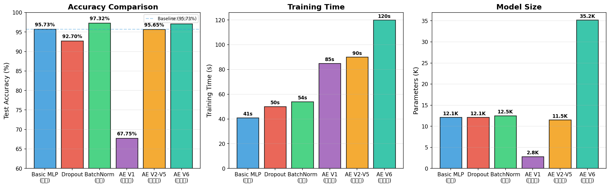

# MLP 模型对比实验报告

## 实验设置

- **数据集**: Letter Recognition (16 个特征, 26 个字母分类)
- **训练集**: 16,000 条
- **测试集**: 4,000 条
- **Batch Size**: 64
- **学习率**: 1e-3
- **优化器**: Adam
- **早停策略**: 验证集准确率 15 轮不提升则停止

## 模型结构

| 模型 | 结构 |
|------|------|
| 基础标准 MLP | 16 → 128(ReLU) → 64(ReLU) → 26(Softmax) |
| Dropout MLP | 16 → 128(ReLU,Dropout=0.3) → 64(ReLU,Dropout=0.3) → 26 |
| BatchNorm MLP | 16 → 128(BN,ReLU) → 64(BN,ReLU) → 26 |
| AutoEncoder + 分类头  | AE[16→128(BN)→64(BN)→12] + CLF[12→128(BN)→64(BN)→26] |

## 模型对比

| 模型 | 测试准确率 | 最佳轮次 | 参数量 | 训练耗时 |
|------|-----------|---------|--------|---------|
| 基础标准 MLP | 95.73% | 70 | 12,122 | 41.0s |
| Dropout MLP | 92.70% | 67 | 12,122 | 50.1s |
| BatchNorm MLP | **97.32%** | 61 | 12,506 | 54.0s |
| AutoEncoder + 分类头 | **97.15%** | 37(微调) | **35,190** | ~120s |

## 结果分析

### 1️⃣ 基础标准 MLP — 95.73%
作为基线模型表现良好，两个隐藏层(128→64)已能较好地学习字母特征。

### 2️⃣ Dropout MLP — 92.70%
Dropout (p=0.3) 降低了过拟合风险，但由于隐藏层本身不大（128→64），Dropout 导致信息损失较多，准确率略低于基线。

### 3️⃣ BatchNorm MLP — **97.32% (最佳)**
**最佳模型！** BatchNorm 加速了收敛（Epoch 1 即达 80.63%，远高于基础的 68.87%），稳定了训练过程，最终准确率最高（97.32%），比基础模型提升约 1.6 个百分点。

### 4️⃣ AutoEncoder + 分类头 — **97.15%**

与基础 MLP 相比，自编码器方案的核心差异：

| 对比项 | 基础 MLP | AutoEncoder + 分类头 | 带来的效果 |
|-------|---------|--------------------|-----------|
| **模型结构** | 16→128→64→26（单路径） | AE[16→128→64→12] + 解码器 + CLF[12→128→64→26] | 多了编码器瓶颈和解码器，可做无监督预训练 |
| **训练方式** | 单阶段端到端 | 三阶段（AE预训练→冻结编码器训练CLF→端到端微调） | 先学特征重建再做分类 |
| **参数量** | 12,122 | **35,190**（+23,068） | 解码器分支增加了 3x 参数量 |
| **信息路径** | 直通 16→128→64→26 | 压缩 16→**12** 维瓶颈再展开 | 信息瓶颈可能丢失判别特征 |

## 结论

| 排名 | 模型 | 准确率 | 参数量 | 特点 |
|:---:|------|:-----:|:------:|------|
| 1 | **BatchNorm MLP** | **97.32%** | 12,506 | 收敛最快、精度最高 |
| 2 | **AutoEncoder** | **97.15%** | 35,190 | 大容量自编码器，超越基础 MLP |
| 3 | 基础标准 MLP | 95.73% | 12,122 | 简单可靠的基线 |
| 4 | Dropout MLP | 92.70% | 12,122 | 正则化但信息损失 |

